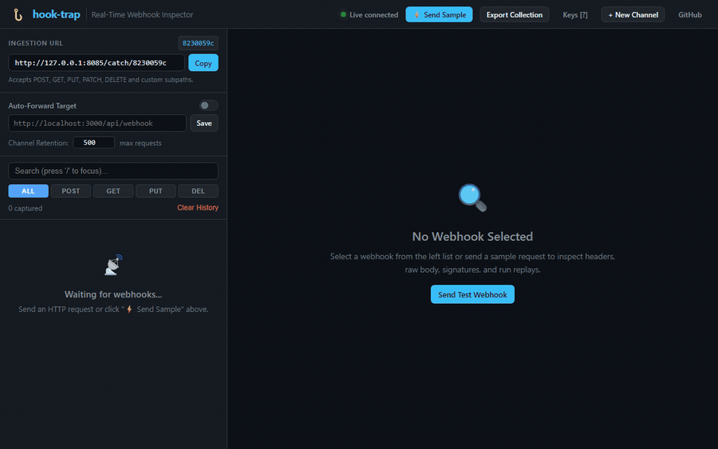

<p align="center">
  
</p>

<h1 align="center">hook-trap</h1>

<p align="center">
  <b>Real-Time Webhook Inspector, Debugger & Local Replay Proxy</b>
</p>

<p align="center">
  <a href="LICENSE"></a>
  
  
  
  
  <a href="https://github.com/alexandrmotologa/hooktrap-live"></a>
</p>

<p align="center">
  When you develop applications that receive webhooks from Stripe, GitHub, Shopify, or Twilio, testing endpoints locally usually requires third-party tunnel services or repeated manual requests. <code>hook-trap</code> runs locally, receives incoming payloads on isolated channel URLs, logs them in SQLite, streams them in real time over WebSockets to a dark mode dashboard, and replays them to your development server with one click.
</p>

<p align="center">
  
</p>

## Screenshots

<details open>
<summary><strong>Expand interface gallery</strong></summary>
<br/>

| Dashboard Overview | Payload Diff Comparison |
| :---: | :---: |
|  |  |

| Request Headers & Signature Badges | Built-in Signature Validator |
| :---: | :---: |
|  |  |

| Code Snippet Export (cURL, Python, JS) | Postman & Bruno Collection Export |
| :---: | :---: |
|  |  |

| Keyboard Shortcuts Dialog |
| :---: |
|  |

</details>

---

## Brand Mascot: The Wire Mantis

`hook-trap` is represented by the **Wire Mantis** (*Mantis Intercepta*).

In nature, the praying mantis sits motionless on branches, tracking movement across a 180-degree visual arc with wide multifaceted compound optics. The microsecond prey enters strike range, its raptorial forelegs snap shut in under 50 milliseconds—trapping and holding the target in an unbreakable grip.

`hook-trap` brings that exact predatory vigilance to modern API development:
- **Raptorial Hook Claws (`#00f5ff` & `#10b981`)**: Snatches incoming HTTP webhooks off the wire and holds raw request bytes without corruption.
- **Sensory Wire Antennae**: Real-time WebSocket streaming and terminal live tailing that detect deliveries instantaneously.
- **Obsidian & Slate Carapace (`#060911` — `#475569`)**: Local-first persistence backed by SQLite WAL, preserving exact HMAC signatures (`Stripe-Signature`, `X-Hub-Signature-256`, `X-Shopify-Hmac-Sha256`) for one-click replay.

---

## Features

- **Universal ingestion paths**: Send requests using any HTTP method (POST, GET, PUT, PATCH, DELETE) to `/catch/<channel_id>` or nested subpaths like `/catch/<channel_id>/v1/events`.
- **Live WebSocket streaming**: Inspect payloads and headers as they arrive without refreshing the browser.
- **Terminal live tailing**: Stream incoming events directly to your command line with `hook-trap tail <channel_id>`.
- **Public tunnel support**: Expose your local inspector over a public HTTPS address using `--tunnel cloudflare` or `--tunnel ngrok`.
- **Sample webhook generator**: Send pre-configured Stripe, GitHub, or Shopify test webhooks to your channel with one click.
- **Payload diff comparison**: Compare two captured payloads side by side to inspect changes between webhook deliveries and retries.
- **Exact payload and signature retention**: Preserves raw body bytes and headers, including HMAC signatures from Stripe (`Stripe-Signature`), GitHub (`X-Hub-Signature-256`), and Shopify (`X-Shopify-Hmac-Sha256`).
- **HTTP replay engine**: Replay any captured webhook to a local endpoint such as `http://localhost:3000/api/webhook`, recording latency, status codes, and response headers.
- **Automatic forwarding**: Forward incoming webhooks to your local service as soon as they hit the receiver.
- **Automated Webhook Sequence Runner**: Chain captured requests into ordered multi-step scenario sequences (e.g. `customer.created` -> `payment_intent.succeeded` -> `invoice.paid`) with configurable inter-step delays, live WebSocket progress streaming, and assertion verification against expected HTTP status codes.
- **Payload Fuzzing & Mutation Testing Suite**: Deterministically stress test endpoints with null injections, missing required schema keys, type confusion, corrupted HMAC signatures, and malformed JSON syntax to verify graceful 4xx client rejection vs unhandled 5xx server crashes.
- **Built-in signature validator**: Test your webhook signing secrets against incoming headers and raw request bodies directly in the interface.
- **Code & collection export**: Export captured requests as cURL commands, Python `httpx` scripts, JavaScript `fetch` calls, or complete Postman v2.1 and Bruno collections.
- **Channel retention policies**: Configure maximum stored requests per channel with automatic database pruning.
- **Keyboard navigation**: Navigate requests and trigger actions using vim-style and standard shortcuts (`j`, `k`, `r`, `c`, `d`, `s`, `e`, `f`, `?`).
- **Zero build dependencies**: The web inspector uses vanilla JavaScript and CSS served directly by FastAPI. No Node.js or build steps required.


## Quick start

### Prerequisites

Python 3.12 or newer.

### Installation

Clone the repository and install the dependencies:

```bash
git clone https://github.com/alexandrmotologa/hook-trap.git
cd hook-trap
pip install -e .
```

Alternatively, install using `uv`:

```bash
uv pip install -e ".[dev]"
```

### Running the server

Start the server using the command line interface:

```bash
hook-trap serve --port 8080 --open-browser
```

By default, the server listens on `http://127.0.0.1:8080`.

To start with a public HTTPS tunnel via Cloudflare:

```bash
hook-trap serve --port 8080 --tunnel cloudflare
```

To automatically forward every incoming webhook to your local development service:

```bash
hook-trap serve --port 8080 --auto-forward http://localhost:3000/api/webhook
```

### Streaming events in your terminal

To monitor webhooks live in the console without opening a browser:

```bash
hook-trap tail a1b2c3d4
```

To inspect full headers in the terminal stream:

```bash
hook-trap tail a1b2c3d4 --headers
```

## How to use

1. Open `http://localhost:8080` in your browser. The application redirects to a unique channel, for example `http://localhost:8080/c/a1b2c3d4`.
2. Copy the ingestion URL shown in the top left card (`http://localhost:8080/catch/a1b2c3d4`).
3. Point your webhook provider or test script to this URL:

```bash
curl -X POST http://localhost:8080/catch/a1b2c3d4 \
  -H "Content-Type: application/json" \
  -H "X-Custom-Header: value" \
  -d '{"event": "user.created", "user_id": 42}'
```

4. Or click **⚡ Send Sample** in the top navigation bar to generate test Stripe or GitHub events immediately.
5. In the top replay bar, enter your local API address (`http://localhost:3000/api/webhook`) and click **Replay** to send the exact request to your local application.

## Keyboard shortcuts

Press `?` in the dashboard to view all shortcuts:

| Key | Action |
|---|---|
| `j` or `↓` | Select next request in list |
| `k` or `↑` | Select previous request in list |
| `r` | Replay currently selected request |
| `c` | Copy ingestion URL |
| `d` | Open payload Diff comparison viewer |
| `s` | Open Send Sample Webhook dialog |
| `e` | Open Code Export modal (cURL, Python, JS) |
| `f` | Open Payload Fuzzing test suite dialog |
| `/` | Focus the search input bar |
| `?` | Open keyboard shortcuts help |
| `Esc` | Close any open modal |

## CLI reference

### `hook-trap serve`

| Option | Shorthand | Default | Description |
|---|---|---|---|
| `--port` | `-p` | `8080` | Port for the HTTP server |
| `--host` | `-h` | `127.0.0.1` | Network interface to bind to |
| `--db-path` | | `hook_trap.db` | File path for the SQLite database |
| `--auto-forward` | `-f` | None | Default target URL for automatic forwarding |
| `--tunnel` | `-t` | None | Start a public HTTPS tunnel (`cloudflare`, `ngrok`, `auto`) |
| `--open-browser` | `-b` | `false` | Automatically opens the browser dashboard |
| `--log-level` | | `info` | Uvicorn logging level |

### `hook-trap tail <channel_id>`

| Option | Shorthand | Default | Description |
|---|---|---|---|
| `--host` | `-h` | `127.0.0.1` | Server host |
| `--port` | `-p` | `8080` | Server port |
| `--headers` | | `false` | Display all request headers in terminal output |
| `--raw` | | `false` | Output raw JSON lines |

## Testing upstream retries

To test how upstream providers handle failures, you can simulate specific status codes by appending the `status` query parameter to the catch URL:

```bash
# Simulates a 503 Service Unavailable response
curl -X POST "http://localhost:8080/catch/a1b2c3d4?status=503" \
  -H "Content-Type: application/json" \
  -d '{"retry_test": true}'
```

The server stores the payload normally, notifies the dashboard, and returns HTTP 503 to the caller.

## Running with Docker

Build and run using Docker Compose:

```bash
docker compose up --build
```

Or build the image directly:

```bash
docker build -t hook-trap .
docker run -p 8080:8080 -v hook_trap_data:/data hook-trap
```

## Running tests

Run the test suite with pytest:

```bash
pytest -v tests/
```

## Documentation

- [Architecture Guide](docs/architecture.md): Overview of components, database schema, and WebSocket event flow.
- [API Reference](docs/api_reference.md): Specification of REST endpoints and WebSocket events.
- [Webhook Provider Guides](docs/webhook_guides.md): Recipes for testing Stripe, GitHub, Shopify, and Svix webhooks.
- [CLI Guide](docs/cli_guide.md): Command line flags and environment variables.

## License

This project is licensed under the MIT License - see the [LICENSE](LICENSE) file for details.
